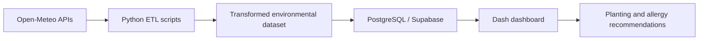

# 🌱 Garden & Allergy Forecast Analytics Platform

A portfolio-ready analytics project that turns environmental data into actionable recommendations for gardeners and allergy-sensitive users in Louisville, Kentucky. This repository demonstrates a full workflow from API ingestion and transformation to database loading and interactive visualization.

## Why this project stands out

This project is designed to show employers that I can build practical, end-to-end data products rather than isolated scripts or notebooks. It combines:

- real-world data acquisition from public APIs
- robust transformation and validation logic
- database-backed analytics workflows
- a polished user experience for decision support

## Executive summary

I built a full environmental analytics solution that gathers weather, air quality, soil, and pollen information, transforms it into a consistent dataset, and delivers actionable guidance through an interactive dashboard. The project reflects the kind of work expected in data engineering, analytics engineering, and analytics product roles: ingestion, modeling, transformation, and presentation.

## Impact statement

This project turns fragmented environmental signals into a single decision-support experience. Instead of asking users to compare multiple sources manually, it consolidates the information into a clear, usable product that supports planning, forecasting, and daily decision-making.

- API-based data engineering
- Python ETL development
- SQL and database modeling
- Interactive dashboard development
- Product-oriented decision logic for recommendations

## What I built

- A repeatable ETL workflow that collects weather, soil, air quality, and pollen data
- A PostgreSQL/Supabase-ready schema for structured analytics
- A recommendation engine that suggests planting actions based on current conditions
- A Dash dashboard that presents forecasts, health signals, and planting guidance in a polished UI

## Core technologies

- Python
- Pandas and SQLAlchemy
- PostgreSQL / Supabase
- Dash and Plotly
- Open-Meteo APIs
- SQL schema design

## Project architecture



## Key capabilities

- 7-day environmental forecasting
- Pollen and AQI monitoring
- Soil temperature and moisture analysis
- Planting readiness scoring
- Allergy-risk awareness for daily decision-making

## Repository structure

- [dashboard/](dashboard/) — Dash application and visualization logic
- [docs/](docs/) — architecture, setup, and project overview notes
- [etl/](etl/) — reusable ETL scripts and pipeline modules
- [notebooks/](notebooks/) — exploratory notebooks and analysis
- [sql/](sql/) — schema and load scripts
- [data/](data/) — source and processed datasets
- [tests/](tests/) — lightweight smoke tests for project entry points

## Quick start

```bash
python -m venv .venv
source .venv/bin/activate
pip install -r requirements.txt
cp .env.example .env
python app.py
```

Then open http://localhost:8050.

For setup details, see [docs/SETUP.md](docs/SETUP.md).

## What this demonstrates for employers

- I can connect external data sources and build reliable ingestion workflows
- I understand data transformation, validation, and schema design
- I can move from raw data to a user-facing analytics experience
- I can structure a repository in a way that is clear, explainable, and easy to review

## Skills aligned to common roles

### Data Engineer
- ETL development
- API ingestion
- Data quality handling
- Database-oriented workflows

### Analytics Engineer
- Structured data modeling
- SQL-based transformation logic
- Analytical dataset design

### Data Analyst / BI Developer
- Dashboard storytelling
- KPI-oriented visualization
- Decision-support product design

## Additional documentation

For a quick view of the repository organization and what belongs in each folder, see [docs/REPO_LAYOUT.md](docs/REPO_LAYOUT.md).

- [docs/REPO_LAYOUT.md](docs/REPO_LAYOUT.md)
- [docs/ARCHITECTURE.md](docs/ARCHITECTURE.md)
- [docs/PROJECT_OVERVIEW.md](docs/PROJECT_OVERVIEW.md)
- [docs/SETUP.md](docs/SETUP.md)
- [docs/PORTFOLIO_SUMMARY.md](docs/PORTFOLIO_SUMMARY.md)

